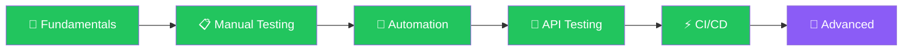

<!-- Soft Gradient Header -->

&nbsp;

&nbsp;

  

 

## About

I'm a **Test Automation Engineer** passionate about building reliable test frameworks and ensuring software quality. Currently working at **Craftsmen** as SDET-I, focusing on AI-powered test automation.

**What I do:**
- Design and implement scalable test automation frameworks
- API testing and performance optimization  
- CI/CD pipeline integration
- Mentoring teams on QA best practices

 

## Tech Stack

#### Testing & Automation

#### Languages

#### DevOps & Tools

 

## QA Roadmap

| Phase | Topics | Status |
|:------|:-------|:------:|
| **Fundamentals** | SDLC, STLC, Test Types, Bug Reporting | ✅ |
| **Manual Testing** | Test Planning, Exploratory, Cross-browser | ✅ |
| **Automation** | Selenium, Playwright, Framework Design (POM/BDD) | ✅ |
| **API Testing** | REST, GraphQL, Postman, REST Assured | ✅ |
| **CI/CD** | Jenkins, GitHub Actions, Docker | ✅ |
| **Advanced** | Performance, Security, AI in Testing | 🔄 |

 

## GitHub Stats

&nbsp;&nbsp;&nbsp;

  

 

## Let's Connect

I'm always open to discussing test automation, quality engineering, or potential collaborations.

 

🌐 **Portfolio:** [noorearafin.trendport.com](https://noorearafin.trendport.com)

📧 **Email:** [noorearafin@gmail.com](mailto:noorearafin@gmail.com)

💼 **LinkedIn:** [noor-e-arafin-rafi](https://www.linkedin.com/in/noor-e-arafin-rafi-18a2911a7/)

 

&nbsp;

 

