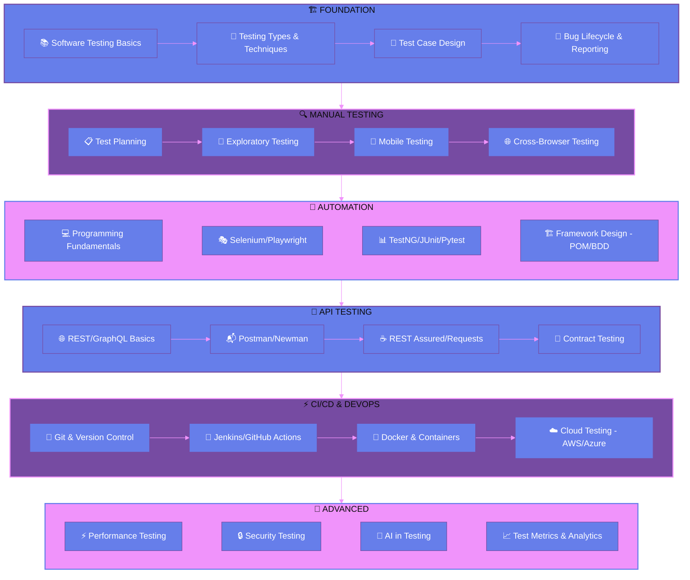

<div align="center">
  
<!-- Animated Header Banner -->


<!-- Animated Typing SVG -->
<a href="https://git.io/typing-svg"></a>

<!-- Profile Views & Social Badges -->
<p>
  
  <a href="https://noorearafin.trendport.com" target="_blank">
    
  </a>
</p>

<!-- Animated Divider -->


</div>

##  About Me

```typescript
const rafi = {
    pronouns: "he" | "him",
    role: "Software Engineer in Test - I",
    company: "Craftsmen",
    location: "Bangladesh 🇧🇩",
    
    currentMission: "Implementing AI in Test Automation",
    
    expertise: {
        automation: ["Playwright", "Selenium", "Cypress", "Appium"],
        languages: ["JavaScript", "TypeScript", "Java", "Python"],
        frameworks: ["TestNG", "JUnit", "Pytest", "Mocha"],
        ci_cd: ["Jenkins", "GitHub Actions", "Azure DevOps"],
        cloud: ["AWS", "Docker", "Kubernetes"]
    },
    
    philosophy: "Quality is everyone's responsibility, but ensuring it is mine."
};
```

<div align="center">

</div>

##  Current Focus

<table align="center">
<tr>
<td width="50%" align="center">

### 🎯 What I'm Doing
  
🔭 **SDET-I at Craftsmen**

🧠 **AI-Powered Test Automation**

📚 **Continuous Learning & Sharing**

💡 **Building Scalable Test Frameworks**

</td>
<td width="50%" align="center">

### 💬 Ask Me About
  
✅ Test Strategy & Planning

✅ Automation Framework Design

✅ CI/CD Pipeline Integration

✅ Performance Testing

✅ API Testing Best Practices

</td>
</tr>
</table>

<div align="center">

</div>

##  Tech Arsenal

<div align="center">

### 🧪 Testing & Automation


### 💻 Languages & Frameworks


### ☁️ DevOps & Cloud


### 🛠️ Tools & Platforms


</div>

<div align="center">

</div>

## 🗺️ QA Engineer Roadmap

<div align="center">



</div>

### 📍 My Journey Progress

| Phase | Skills | Status |
|:---:|:---|:---:|
| 🏗️ | **Foundation** - Testing Fundamentals, SDLC, STLC | ✅ Completed |
| 🔍 | **Manual Testing** - Test Planning, Exploratory, Cross-browser | ✅ Completed |
| 🤖 | **Automation** - Selenium, Playwright, Framework Design | ✅ Completed |
| 🔌 | **API Testing** - REST Assured, Postman, Contract Testing | ✅ Completed |
| ⚡ | **CI/CD** - Jenkins, GitHub Actions, Docker | ✅ Completed |
| 🚀 | **Advanced** - Performance, Security, AI Testing | 🔄 In Progress |

<div align="center">

</div>

## 📊 GitHub Analytics

<div align="center">
  
<a href="https://github.com/noorearafin">
  
  
</a>

<br/>

<!-- GitHub Streak -->


<br/>

<!-- GitHub Trophy -->


</div>

<div align="center">

</div>

## 📈 Contribution Graph

<div align="center">
  
[](https://github.com/ashutosh00710/github-readme-activity-graph)

</div>

<div align="center">

</div>

## 🏆 Achievements & Certifications

<div align="center">

<a href="https://www.hackerrank.com/noorearafin">
  
</a>


</div>

### 📜 Certifications & Learning

<table align="center">
<tr>
<td align="center" width="200">

<br/><b>ISTQB CTFL</b>
<br/><sub>Foundation Level</sub>
</td>
<td align="center" width="200">

<br/><b>AWS Cloud</b>
<br/><sub>Practitioner</sub>
</td>
<td align="center" width="200">

<br/><b>API Testing</b>
<br/><sub>Advanced</sub>
</td>
<td align="center" width="200">

<br/><b>AI in Testing</b>
<br/><sub>In Progress</sub>
</td>
</tr>
</table>

<div align="center">

</div>

## 💼 Featured Projects

<div align="center">

<a href="https://github.com/noorearafin?tab=repositories">
  
</a>
<a href="https://github.com/noorearafin?tab=repositories">
  
</a>

</div>

<p align="center">
  <a href="https://github.com/noorearafin?tab=repositories">
    
  </a>
</p>

<div align="center">

</div>

## 🌐 Connect With Me

<div align="center">

[](https://noorearafin.trendport.com)
[](https://www.linkedin.com/in/noor-e-arafin-rafi-18a2911a7/)
[](mailto:noorearafin@gmail.com)
[](https://www.hackerrank.com/noorearafin)

</div>

<div align="center">

</div>

## 💡 Random Dev Quote

<div align="center">
  


</div>

<div align="center">

</div>

## 🚀 Let's Build Something Amazing Together!

<div align="center">

```
╔══════════════════════════════════════════════════════════════════════╗
║                                                                      ║
║   🎯 "Quality is free, but only to those who are willing to          ║
║       pay heavily for it."                                           ║
║                                                                      ║
║   💼 Open for collaborations on test automation projects             ║
║   📧 Reach out: noorearafin@gmail.com                                ║
║   🌐 Portfolio: noorearafin.trendport.com                            ║
║                                                                      ║
╚══════════════════════════════════════════════════════════════════════╝
```

<br/>


<br/>

<!-- Snake Animation -->
<picture>
  <source media="(prefers-color-scheme: dark)" srcset="https://raw.githubusercontent.com/platane/platane/output/github-contribution-grid-snake-dark.svg">
  <source media="(prefers-color-scheme: light)" srcset="https://raw.githubusercontent.com/platane/platane/output/github-contribution-grid-snake.svg">
  
</picture>

</div>

<!-- Animated Footer -->

